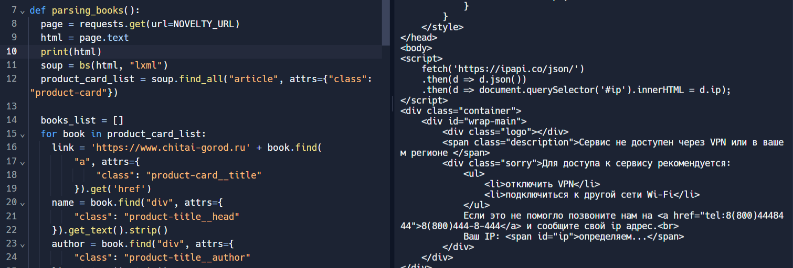
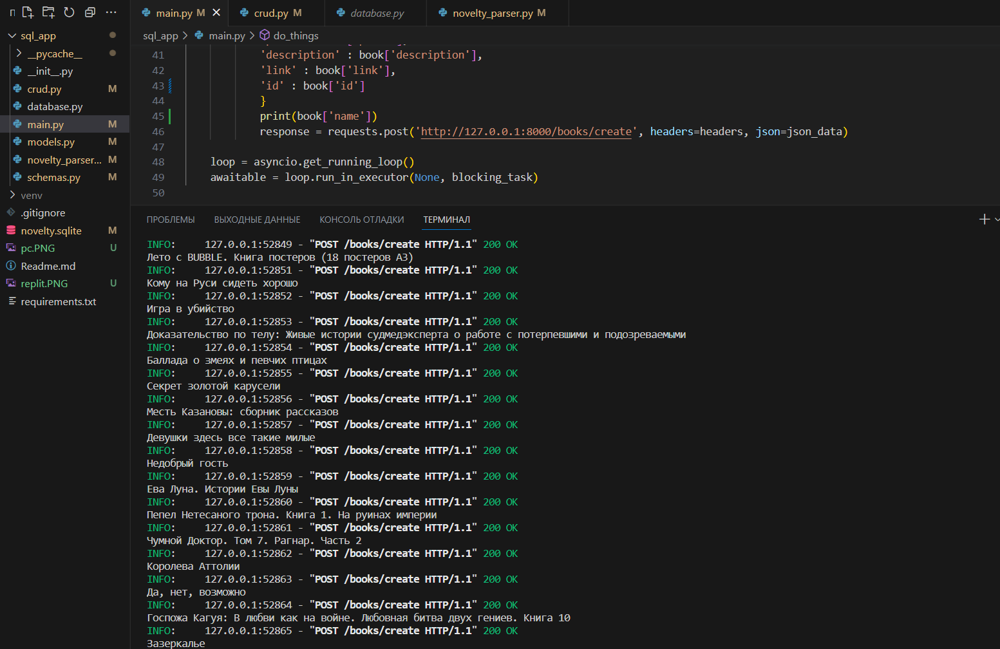

Rest-api, собирающий данные о книжных новинках. Данные берутся с сайта https://www.chitai-gorod.ru/catalog/collections/novelty.

Upd: После выкладки на Replit перестало работать автообновление данных из-за того, что он отправляет запросы с иностранного ip. Я пробовала поменять ip в requests, а также добавить заголовки, но это не помогло. На локальном пк все работает. И еще с 0.0.0.0 почему-то не открывается, только с персональной ссылки booksparser.malinainsugar.repl.co . И еще там в отчете есть ошибки нумерации по типу 1.1.1, они сбились и я заметила это только после того как отправила. Я уже исправила это.

